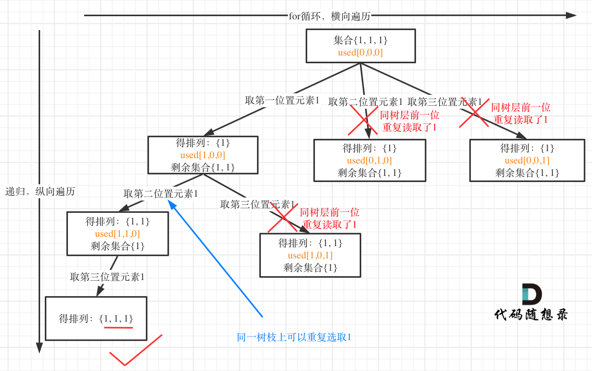

# BackTracking

39\. Combination SumMedium14.6K291Companies

Given an array of **distinct** integers `candidates` and a target integer `target`, return _a list of all **unique combinations** of_ `candidates` _where the chosen numbers sum to_ `target`_._ You may return the combinations in **any order**.

The **same** number may be chosen from `candidates` an **unlimited number of times**. Two combinations are unique if the&#x20;

frequency of at least one of the chosen numbers is different.

The test cases are generated such that the number of unique combinations that sum up to `target` is less than `150` combinations for the given input.


## solution

backtracking model:

<figure><figcaption></figcaption></figure>

```python
class Solution:
    def __init__(self):
        self.res = []
        self.path = []
        
    def combinationSum(self, candidates: List[int], target: int) -> List[List[int]]:
        self.backtrack(candidates, 0, 0, target)
        return self.res

    def backtrack(self, candidates, start, addup, target):
        if addup == target:
            self.res.append(self.path[:])  # 因为是shallow copy，所以不能直接传入self.path
            return
        for i in range(start, len(candidates)):
            if addup > target:
                break
            addup += candidates[i]
            self.path.append(candidates[i])
            self.backtrack(candidates, i, addup, target)
            addup -= candidates[i]
            self.path.pop()
```

### things to notice:

1. the start index. to avoid duplicate, only select afterwards element in dfs. I tried to use hashet and sort at first which is very stupid.If you cant pick one element again, you should use i+1. but if you can use element one more time, pick i.
2. the result: shallow copy wont work. same thing for Java, you need a deep copy when append list to list


## Permutation

46\. PermutationsMedium14.2K240Companies

Given an array `nums` of distinct integers, return _all the possible permutations_. You can return the answer in **any order**.

&#x20;

**Example 1:**

<pre><code><strong>Input: nums = [1,2,3]
</strong><strong>Output: [[1,2,3],[1,3,2],[2,1,3],[2,3,1],[3,1,2],[3,2,1]]
</strong></code></pre>

### SOLUTOIN

the first question was combination, where we need to use a start index to help avoid choose previous elements. For permutation you have to choose back. so no start index. But how to avoid use same element again? hashset, check element in array, or usage list that record Used or not.

```python
class Solution:
    def __init__(self):
        self.path = []
        self.res = []
        self.used = [False]

    def permute(self, nums: List[int]) -> List[List[int]]:
        self.used = self.used * len(nums)
        self.backtrack(nums)
        return self.res

    def backtrack(self, nums):
        if len(self.path) == len(nums):
            self.res.append(self.path[:])
        for i in range(0, len(nums)):
            if self.used[i]:
                continue
            self.used[i] = True
            self.path.append(nums[i])
            self.backtrack(nums)
            self.path.pop()
            self.used[i] = False
        
```

note the usage list is not meant to handle with array with duplicate element. like \[1, 2, 2, 3]. 2 is used no matter which 2 is used. I guess thats why the problem assume the element is distinct

### Permutation II

47\. Permutations IIMedium6.9K125Companies

Given a collection of numbers, `nums`, that might contain duplicates, return _all possible unique permutations **in any order**._


**Example 1:**

<pre><code><strong>Input: nums = [1,1,2]
</strong><strong>Output:
</strong>[[1,1,2],
 [1,2,1],
 [2,1,1]]
</code></pre>

这个去重为什么很难理解呢，**所谓去重，其实就是使用过的元素不能重复选取。** 这么一说好像很简单！

都知道组合问题可以抽象为树形结构，那么“使用过”在这个树形结构上是有两个维度的，一个维度是同一树枝上使用过，一个维度是同一树层上使用过。**没有理解这两个层面上的“使用过” 是造成大家没有彻底理解去重的根本原因。**

那么问题来了，我们是要同一树层上使用过，还是同一树枝上使用过呢？

回看一下题目，元素在同一个组合内是可以重复的，怎么重复都没事，但两个组合不能相同。

**所以我们要去重的是同一树层上的“使用过”，同一树枝上的都是一个组合里的元素，不用去重**。

为了理解去重我们来举一个例子，candidates = \[1, 1, 2], target = 3，（方便起见candidates已经排序了）

**强调一下，树层去重的话，需要对数组排序！**

**The key idea is: for dupicate element's permutation, we should only choose one from the duplicates element to go deep for the result.**&#x20;

<figure><figcaption></figcaption></figure>

```python
class Solution:
    def __init__(self):
        self.path = []
        self.res = []
        self.used = [False]

    def permuteUnique(self, nums: List[int]) -> List[List[int]]:
        self.used = self.used * len(nums)
        nums = sorted(nums)
        self.backtrack(nums)
        return self.res

    def backtrack(self, nums):
        if len(self.path) == len(nums):
            self.res.append(self.path[:])
        for i in range(0, len(nums)):
            if self.used[i]:
                continue
            if i > 0 and nums[i] == nums[i - 1] and self.used[i - 1] == False:
                continue
            self.used[i] = True
            self.path.append(nums[i])
            self.backtrack(nums)
            self.path.pop()
            self.used[i] = False
        
```

```python
if i < len(nums) - 1 and nums[i] == nums[i + 1] and self.used[i + 1] == False:
    continue
```

this also worrks as long as you are ruling out the duplicate on the same tree choose level. when you choose the second element of your result, in your selection range, is there only one duplicate to choose?.

Imagine `self.used[i - 1] == True` would also works, but the meaning changes: this means if there is a duplicate while the duplicate was chosen on the previous level, we skip this. Unless you pick the last duplicate first. **They are pretty much the same idea on earth: for duplicate friends, we only keep one permutation.** &#x20;
